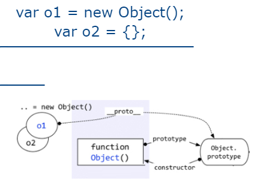
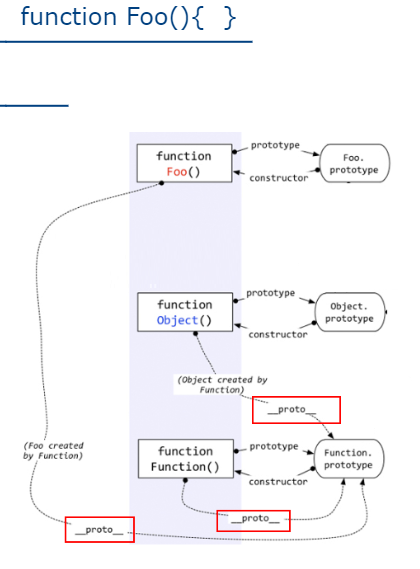
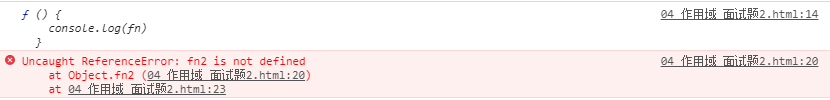

# js经典问题

## 1.解释下JavaScript中this是如何工作的。
this永远指向函数运行时所在的对象，而不是函数被创建时所在的对象。匿名函数或不处于任何对象中的函数指向window 。

+ 如果是call，apply,with，指定的this是谁，就是谁。

+ 普通的函数调用，函数被谁调用，this就是谁。

## 2.js的事件循环机制

## 3.闭包
### 闭包的概念
* 使用chrome调试查看
  * 理解一: 闭包是嵌套的内部函数(绝大部分人)
  * 理解二: 包含被引用变量(函数)的对象(极少数人)
  * 注意: 闭包存在于嵌套的内部函数中

### 闭包的产生
在外部函数里的内部函数中，当内部函数，调用外部函数的变量或实参时。同时在全局中
调用了外部函数，**产生闭包**。一开始，闭包的变量值为未定义，当内部函数被调用时将
外部函数的变量赋值给闭包的变量。

### 闭包的作用
使用函数内部的变量在函数执行完后, 仍然存活在内存中(延长了局部变量的生命周期)
让函数外部可以操作(读写)到函数内部的数据(变量/函数)

### 闭包的生命周期
产生: 在嵌套内部函数定义执行完时就产生了(不是在调用)
死亡: 在嵌套的内部函数成为垃圾对象时

### 闭包的应用
定义JS模块
  * 具有特定功能的js文件
  * 将所有的数据和功能都封装在一个函数内部(私有的)
  * 只向外暴露一个包信n个方法的对象或函数
  * 模块的使用者, 只需要通过模块暴露的对象调用方法来实现对应的功能

Module.js
```javascript
(function (window) {
  //私有的数据
  var msg = 'atguigu'
  var names = ['I', 'Love', 'you']
  //操作数据的函数
  function a() {
    console.log(msg.toUpperCase())
  }
  function b() {
    console.log(names.join(' '))
  }

  window.coolModule2 =  {
    doSomething: a,
    doOtherthing: b
  }
})(window)
```
index.html
```html
<!DOCTYPE html>
<html lang="en">
<head>
  <meta charset="UTF-8">
  <title>05_闭包的应用_自定义JS模块2</title>
</head>
<body>
<script type="text/javascript" src="Module.js"></script>
<script type="text/javascript">
  //调用闭包函数
  coolModule2.doSomething()
  coolModule2.doOtherthing()
</script>
</body>
</html>
```
### 闭包的缺点
+ 缺点
  * 函数执行完后, 函数内的局部变量没有释放, 占用内存时间会变长
  * 容易造成内存泄露
+ 解决
  * 能不用闭包就不用
  * 及时释放
```javascript
<script type="text/javascript">
  function fn1() {
    var a = 2;

    function fn2() {
      a++;
      console.log(a);
    }

    return fn2;
  }
  var f = fn1();

  f(); // 3
  f(); // 4

  f = null // 释放
</script>
```

### 面试题
```javascript
<script type="text/javascript">
  /*
   说说它们的输出情况
   */

  //代码片段一,无闭包
  var name = "The Window";
  var object = {
    name: "My Object",
    getNameFunc: function () {
      return function () {
        return this.name;
      };
    }
  };
  console.log(object.getNameFunc()());  //?

  //代码片段二，有闭包，常用
  var name2 = "The Window";
  var object2 = {
    name2: "My Object",
    getNameFunc: function () {
      var that = this;
      return function () {
        return that.name2;
      };
    }
  };
  console.log(object2.getNameFunc()()); //?
</script>
```
输出：
- The Window
- My Object

```javascript
<script type="text/javascript">
  /*
   说说它们的输出情况
   */

  function fun(n, o) {
    console.log(o)
    return {
      fun: function (m) {
        return fun(m, n)
      }
    }
  }
  var a = fun(0)
  a.fun(1)
  a.fun(2)
  a.fun(3) //undefined,?,?,?

  var b = fun(0).fun(1).fun(2).fun(3) //undefined,?,?,?

  var c = fun(0).fun(1)
  c.fun(2)
  c.fun(3) //undefined,?,?,?
</script>
```
输出：


## 4.原型与原型链

### 显式原型
* 函数的prototype属性
  * 每个构造函数都有一个prototype属性, 它默认指向一个Object空对象(但object不满足)
  * 原型对象中有一个属性constructor, 它指向构造函数对象


### 隐式原型
* 每个构造函数function都有一个prototype，即显式原型
* 每个实例对象都有一个__proto__，可称为隐式原型，所有函数都是Function的实例（包括Function）
* 对象的隐式原型的值为其对应构造函数的显式原型的值
* 内存结构(图)


* 总结:
  * 函数的prototype属性: 在定义函数时自动添加的, 默认值是一个空Object对象
  * 对象的__proto__属性: 创建对象时自动添加的, 默认值为构造函数的prototype属性值
  * 程序员能直接操作显式原型, 但不能直接操作隐式原型(ES6之前)

### 原型链
* 原型链(图解)
  * 访问一个对象的属性时，
    * 先在自身属性中查找，找到返回
    * 如果没有, 再沿着__proto__这条链向上查找, 找到返回
    * 如果最终没找到, 返回undefined
    * Object的原型对象是原型链的尽头
  * 别名: 隐式原型链
  * 作用: 查找对象的属性(方法)


* 构造函数/原型/实体对象的关系(图解)



* 构造函数/原型/实体对象的关系2(图解)



### 原型链属性
* 读取对象的属性值时: 会自动到原型链中查找
* 设置对象的属性值时: 不会查找原型链, 如果当前对象中没有此属性, 直接添加此属性并设置其值
* 方法一般定义在原型中, 属性一般通过构造函数定义在对象本身上。同一个构造函数的生成的实例对象的隐式原型相同
即定义在原型上的方法会在实例中共享
```javascript
<script type="text/javascript">
  function Person(name, age) {
    this.name = name;
    this.age = age;
  }
  // 在原型上定义方法
  Person.prototype.setName = function (name) {
    this.name = name;
  }
  Person.prototype.sex = '男';

  var p1 = new Person('Tom', 12)
  p1.setName('Jack')
  console.log(p1.name, p1.age, p1.sex)
  p1.sex = '女'
  console.log(p1.name, p1.age, p1.sex)

  var p2 = new Person('Bob', 23)
  console.log(p2.name, p2.age, p2.sex)

</script>
```


## 5.js的同步与异步

## 6.作用域与作用域链
### 作用域
+ **理解：**
  * 就是一块"地盘", 一个代码段所在的区域
  * 它是静态的(相对于上下文对象), 在编写代码时就确定了
+ **分类：**
  * 全局作用域
  * 函数作用域
  * 没有块作用域(ES6有了)
+ **作用：**
  * 隔离变量，不同作用域下同名变量不会有冲突

### 作用域与执行上下文
+ **区别1**
  * 全局作用域之外，每个函数都会创建自己的作用域，作用域在函数定义时就已经确定了。而不是在函数调用时
  * 全局执行上下文环境是在全局作用域确定之后, js代码马上执行之前创建
  * 函数执行上下文环境是在调用函数时, 函数体代码执行之前创建
+ **区别2**
  * 作用域是静态的, 只要函数定义好了就一直存在, 且不会再变化
  * 上下文环境是动态的, 调用函数时创建, 函数调用结束时上下文环境就会被释放
+ **联系**
  * 上下文环境(对象)是从属于所在的作用域
  * 全局上下文环境==>全局作用域
  * 函数上下文环境==>对应的函数使用域

### 作用域链
+ **理解**
  * 多个上下级关系的作用域形成的链, 它的方向是从下向上的(从内到外)
  * 查找变量时就是沿着作用域链来查找的
+ **查找一个变量的查找规则**
  * 在当前作用域下的执行上下文中查找对应的属性, 如果有直接返回, 否则进入2
  * 在上一级作用域的执行上下文中查找对应的属性, 如果有直接返回, 否则进入3
  * 再次执行2的相同操作, 直到全局作用域, 如果还找不到就抛出找不到的异常

### 面试题1
```
script type="text/javascript">
  /*
   问题: 结果输出多少?
   */
  var x = 10;
  function fn() {
    console.log(x);
  }
  function show(f) {
    var x = 20;
    f();
  }
  show(fn);
</script>
```
输出:10

### 面试题2
```
<script type="text/javascript">
  /*
   说说它们的输出情况
   */

  var fn = function () {
    console.log(fn)
  }
  fn()

  var obj = {
    fn2: function () {
      console.log(fn2)
    }
  }
  obj.fn2()
</script>
```
输出：



