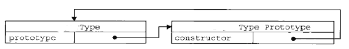
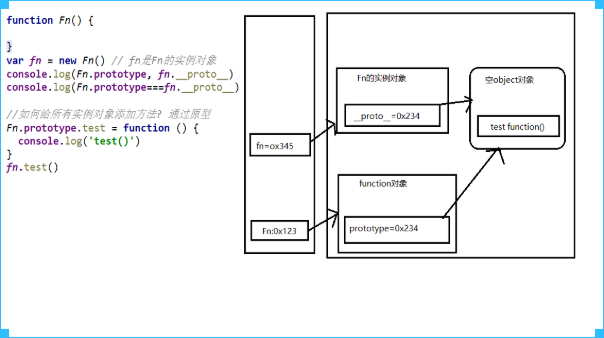
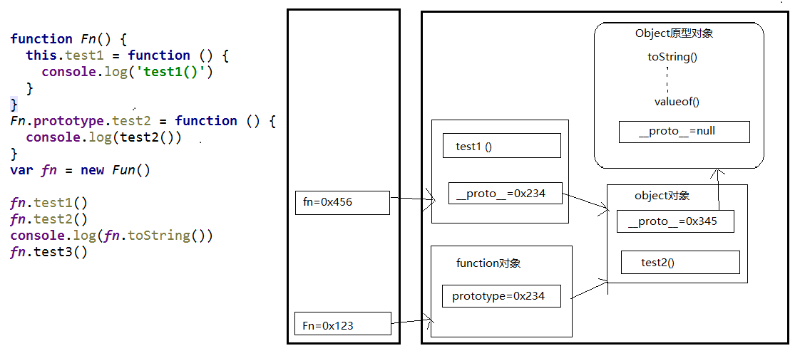
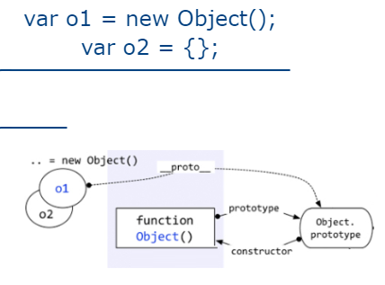
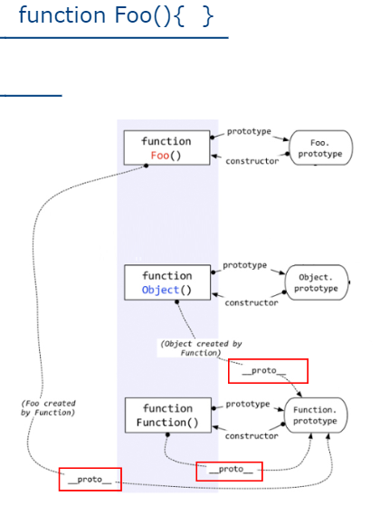
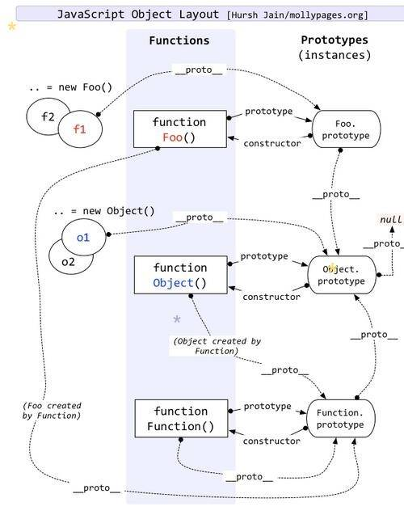
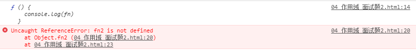
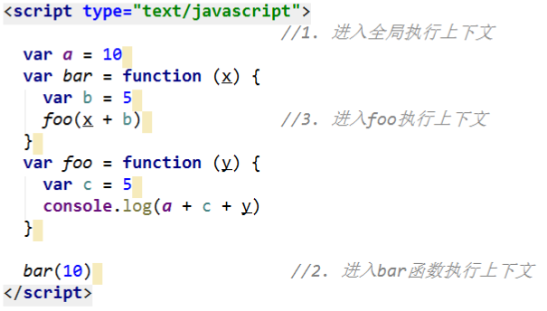
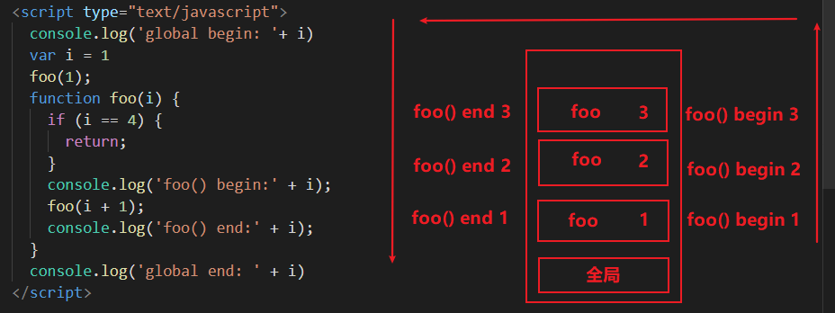
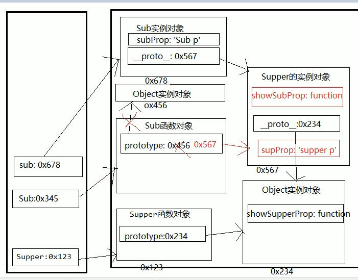

# js经典问题

<!-- TOC -->

- [js经典问题](#js经典问题)
    - [1.解释下JavaScript中this是如何工作的。](#1解释下javascript中this是如何工作的)
    - [2.js的事件循环机制](#2js的事件循环机制)
    - [3.闭包](#3闭包)
        - [闭包的概念](#闭包的概念)
        - [闭包的产生](#闭包的产生)
        - [闭包的作用](#闭包的作用)
        - [闭包的生命周期](#闭包的生命周期)
        - [闭包的应用](#闭包的应用)
        - [闭包的缺点](#闭包的缺点)
        - [面试题](#面试题)
    - [4.原型与原型链](#4原型与原型链)
        - [显式原型](#显式原型)
        - [隐式原型](#隐式原型)
        - [原型链](#原型链)
        - [原型链属性](#原型链属性)
        - [instanceof是如何判断的?](#instanceof是如何判断的)
        - [面试题](#面试题-1)
    - [5.js的同步与异步](#5js的同步与异步)
    - [6.作用域与作用域链](#6作用域与作用域链)
        - [作用域](#作用域)
        - [作用域与执行上下文](#作用域与执行上下文)
        - [作用域链](#作用域链)
        - [面试题1](#面试题1)
        - [面试题2](#面试题2)
    - [7.执行上下文与执行上下文栈](#7执行上下文与执行上下文栈)
        - [变量提升与函数提升](#变量提升与函数提升)
        - [面试题](#面试题-2)
        - [执行上下文](#执行上下文)
        - [执行上下文栈](#执行上下文栈)
        - [面试题](#面试题-3)
    - [对象的创建模式](#对象的创建模式)
        - [方式一: Object构造函数模式](#方式一-object构造函数模式)
        - [方式二: 对象字面量模式](#方式二-对象字面量模式)
        - [方式三: 工厂模式](#方式三-工厂模式)
        - [方式四: 自定义构造函数模式](#方式四-自定义构造函数模式)
        - [方式五: 构造函数+原型的组合模式](#方式五-构造函数原型的组合模式)
    - [9.继承模式](#9继承模式)
        - [方式1：原型链继承](#方式1原型链继承)
        - [方式2: 借用构造函数继承(假的)](#方式2-借用构造函数继承假的)
        - [方式3: 原型链+借用构造函数的组合继承(原型链继承方法，构造函数继承属性)](#方式3-原型链借用构造函数的组合继承原型链继承方法构造函数继承属性)

<!-- /TOC -->


## 1.解释下JavaScript中this是如何工作的。
this永远指向函数运行时所在的对象，而不是函数被创建时所在的对象。匿名函数或不处于任何对象中的函数指向window 。

+ 如果是call，apply,with，指定的this是谁，就是谁。

+ 普通的函数调用，函数被谁调用，this就是谁。

## 2.js的事件循环机制

## 3.闭包
### 闭包的概念
* 使用chrome调试查看
  * 理解一: 闭包是嵌套的内部函数(绝大部分人)
  * 理解二: 包含被引用变量(函数)的对象(极少数人)
  * 注意: 闭包存在于嵌套的内部函数中

### 闭包的产生
在外部函数里的内部函数中，当内部函数，调用外部函数的变量或实参时。同时在全局中
调用了外部函数，**产生闭包**。一开始，闭包的变量值为未定义，当内部函数被调用时将
外部函数的变量赋值给闭包的变量。

### 闭包的作用
使用函数内部的变量在函数执行完后, 仍然存活在内存中(延长了局部变量的生命周期)
让函数外部可以操作(读写)到函数内部的数据(变量/函数)

### 闭包的生命周期
产生: 在嵌套内部函数定义执行完时就产生了(不是在调用)
死亡: 在嵌套的内部函数成为垃圾对象时

### 闭包的应用
定义JS模块
  * 具有特定功能的js文件
  * 将所有的数据和功能都封装在一个函数内部(私有的)
  * 只向外暴露一个包信n个方法的对象或函数
  * 模块的使用者, 只需要通过模块暴露的对象调用方法来实现对应的功能

Module.js
```javascript
(function (window) {
  //私有的数据
  var msg = 'atguigu'
  var names = ['I', 'Love', 'you']
  //操作数据的函数
  function a() {
    console.log(msg.toUpperCase())
  }
  function b() {
    console.log(names.join(' '))
  }

  window.coolModule2 =  {
    doSomething: a,
    doOtherthing: b
  }
})(window)
```
index.html
```html
<!DOCTYPE html>
<html lang="en">
<head>
  <meta charset="UTF-8">
  <title>05_闭包的应用_自定义JS模块2</title>
</head>
<body>
<script type="text/javascript" src="Module.js"></script>
<script type="text/javascript">
  //调用闭包函数
  coolModule2.doSomething()
  coolModule2.doOtherthing()
</script>
</body>
</html>
```
### 闭包的缺点
+ 缺点
  * 函数执行完后, 函数内的局部变量没有释放, 占用内存时间会变长
  * 容易造成内存泄露
+ 解决
  * 能不用闭包就不用
  * 及时释放
```javascript
<script type="text/javascript">
  function fn1() {
    var a = 2;

    function fn2() {
      a++;
      console.log(a);
    }

    return fn2;
  }
  var f = fn1();

  f(); // 3
  f(); // 4

  f = null // 释放
</script>
```

### 面试题
```javascript
<script type="text/javascript">
  /*
   说说它们的输出情况
   */

  //代码片段一,无闭包
  var name = "The Window";
  var object = {
    name: "My Object",
    getNameFunc: function () {
      return function () {
        return this.name;
      };
    }
  };
  console.log(object.getNameFunc()());  //?

  //代码片段二，有闭包，常用
  var name2 = "The Window";
  var object2 = {
    name2: "My Object",
    getNameFunc: function () {
      var that = this;
      return function () {
        return that.name2;
      };
    }
  };
  console.log(object2.getNameFunc()()); //?
</script>
```
输出：
- The Window
- My Object

```javascript
<script type="text/javascript">
  /*
   说说它们的输出情况
   */

  function fun(n, o) {
    console.log(o)
    return {
      fun: function (m) {
        return fun(m, n)
      }
    }
  }
  var a = fun(0)
  a.fun(1)
  a.fun(2)
  a.fun(3) //undefined,?,?,?

  var b = fun(0).fun(1).fun(2).fun(3) //undefined,?,?,?

  var c = fun(0).fun(1)
  c.fun(2)
  c.fun(3) //undefined,?,?,?
</script>
```
输出：


## 4.原型与原型链

### 显式原型
* 函数的prototype属性
  * 每个构造函数都有一个prototype属性, 它默认指向一个Object空对象(但object不满足)
  * 原型对象中有一个属性constructor, 它指向构造函数对象


### 隐式原型
* 每个构造函数function都有一个prototype，即显式原型
* 每个实例对象都有一个__proto__，可称为隐式原型，所有函数都是Function的实例（包括Function）
* 对象的隐式原型的值为其对应构造函数的显式原型的值
* 内存结构(图)



* 总结:
  * 函数的prototype属性: 在定义函数时自动添加的, 默认值是一个空Object对象
  * 对象的__proto__属性: 创建对象时自动添加的, 默认值为构造函数的prototype属性值
  * 程序员能直接操作显式原型, 但不能直接操作隐式原型(ES6之前)

### 原型链
* 原型链(图解)
  * 访问一个对象的属性时，
    * 先在自身属性中查找，找到返回
    * 如果没有, 再沿着__proto__这条链向上查找, 找到返回
    * 如果最终没找到, 返回undefined
    * Object的原型对象是原型链的尽头
  * 别名: 隐式原型链
  * 作用: 查找对象的属性(方法)



* 构造函数/原型/实体对象的关系(图解)



* 构造函数/原型/实体对象的关系2(图解)



### 原型链属性
* 读取对象的属性值时: 会自动到原型链中查找
* 设置对象的属性值时: 不会查找原型链, 如果当前对象中没有此属性, 直接添加此属性并设置其值
* 方法一般定义在原型中, 属性一般通过构造函数定义在对象本身上。同一个构造函数的生成的实例对象的隐式原型相同
即定义在原型上的方法会在实例中共享
```javascript
<script type="text/javascript">
  function Person(name, age) {
    this.name = name;
    this.age = age;
  }
  // 在原型上定义方法
  Person.prototype.setName = function (name) {
    this.name = name;
  }
  Person.prototype.sex = '男';

  var p1 = new Person('Tom', 12)
  p1.setName('Jack')
  console.log(p1.name, p1.age, p1.sex)
  p1.sex = '女'
  console.log(p1.name, p1.age, p1.sex)

  var p2 = new Person('Bob', 23)
  console.log(p2.name, p2.age, p2.sex)

</script>
```

### instanceof是如何判断的?
  * 表达式: A instanceof B
  * 如果B函数的显式原型对象在A对象的原型链上, 返回true, 否则返回false
```javascript
<script type="text/javascript">
  console.log(Object instanceof Function)
  console.log(Object instanceof Object)
  console.log(Function instanceof Object)
  console.log(Function instanceof Function)
  function Foo() {}
  console.log(Object instanceof  Foo);
</script>
```
输出: true,true,true,true,false

### 面试题
```javascript
<script type="text/javascript">
  /*
  测试题1
   */
  var A = function() {

  }
  A.prototype.n = 1
  var b = new A()
  A.prototype = {
    n: 2,
    m: 3
  }
  var c = new A()
  console.log(b.n, b.m, c.n, c.m)

  /*
   测试题2
   */
  var F = function(){};
  Object.prototype.a = function(){
    console.log('a()')
  };
  Function.prototype.b = function(){
    console.log('b()')
  };
  var f = new F();
  f.a()
  f.b()
  F.a()
  F.b()
</script>
```
完整原型链图

测试一：1, undefined, 2, 3

测试二：a(), 报错, a(), b()


## 5.js的同步与异步

## 6.作用域与作用域链
### 作用域
+ **理解：**
  * 就是一块"地盘", 一个代码段所在的区域
  * 它是静态的(相对于上下文对象), 在编写代码时就确定了
+ **分类：**
  * 全局作用域
  * 函数作用域
  * 没有块作用域(ES6有了)
+ **作用：**
  * 隔离变量，不同作用域下同名变量不会有冲突

### 作用域与执行上下文
+ **区别1**
  * 全局作用域之外，每个函数都会创建自己的作用域，作用域在函数定义时就已经确定了。而不是在函数调用时
  * 全局执行上下文环境是在全局作用域确定之后, js代码马上执行之前创建
  * 函数执行上下文环境是在调用函数时, 函数体代码执行之前创建
+ **区别2**
  * 作用域是静态的, 只要函数定义好了就一直存在, 且不会再变化
  * 上下文环境是动态的, 调用函数时创建, 函数调用结束时上下文环境就会被释放
+ **联系**
  * 上下文环境(对象)是从属于所在的作用域
  * 全局上下文环境==>全局作用域
  * 函数上下文环境==>对应的函数使用域

### 作用域链
+ **理解**
  * 多个上下级关系的作用域形成的链, 它的方向是从下向上的(从内到外)
  * 查找变量时就是沿着作用域链来查找的
+ **查找一个变量的查找规则**
  * 在当前作用域下的执行上下文中查找对应的属性, 如果有直接返回, 否则进入2
  * 在上一级作用域的执行上下文中查找对应的属性, 如果有直接返回, 否则进入3
  * 再次执行2的相同操作, 直到全局作用域, 如果还找不到就抛出找不到的异常

### 面试题1
```javascript
script type="text/javascript">
  /*
   问题: 结果输出多少?
   */
  var x = 10;
  function fn() {
    console.log(x);
  }
  function show(f) {
    var x = 20;
    f();
  }
  show(fn);
</script>
```
输出:10

### 面试题2
```javascript
<script type="text/javascript">
  /*
   说说它们的输出情况
   */

  var fn = function () {
    console.log(fn)
  }
  fn()

  var obj = {
    fn2: function () {
      console.log(fn2)
    }
  }
  obj.fn2()
</script>
```
输出：


## 7.执行上下文与执行上下文栈
简析：逐行执行程序之前，会进行一个全局和函数都会进行数据预处理

### 变量提升与函数提升
* 变量声明提升
  * 通过var定义(声明)的变量, 在定义语句之前就可以访问到
  * 值: undefined
* 函数声明提升
  * 通过function声明的函数, 在之前就可以直接调用
  * 值: 函数定义(对象)

### 面试题
```javascript
<script type="text/javascript">
  /*
   面试题: 输出什么?
   */
  var a = 4
  function fn () {
    // 变量提升,相当于
    // var a;
    // console.log(a)
    // var a = 5
    console.log(a)
    var a = 5
  }
  fn()


  /*变量提升*/
  console.log(a1) //可以访问, 但值是undefined
  /*函数提升*/
  a2() // 可以直接调用

  var a1 = 3
  function a2() {
    console.log('a2()')
  }
</script>
```
输出: undefined

### 执行上下文
* 代码分类(位置)
  * 全局代码
  * 函数代码
* 全局执行上下文
  * 在执行全局代码前将window确定为全局执行上下文
  * 对全局数据进行预处理
    * var定义的全局变量==>undefined, 添加为window的属性
    * function声明的全局函数==>赋值(fun), 添加为window的方法
    * this==>赋值(window)
  * 开始执行全局代码
* 函数执行上下文
  * 在调用函数, 准备执行函数体之前, 创建对应的函数执行上下文对象
  * 对局部数据进行预处理
    * 形参变量==>赋值(实参)==>添加为执行上下文的属性
    * arguments==>赋值(实参列表), 添加为执行上下文的属性
    * var定义的局部变量==>undefined, 添加为执行上下文的属性
    * function声明的函数 ==>赋值(fun), 添加为执行上下文的方法
    * this==>赋值(调用函数的对象)
  * 开始执行函数体代码

### 执行上下文栈
1. 在全局代码执行前, JS引擎就会创建一个栈来存储管理所有的执行上下文对象
2. 在全局执行上下文(window)确定后, 将其添加到栈中(压栈)
3. 在函数执行上下文创建后, 将其添加到栈中(压栈)
4. 在当前函数执行完后,将栈顶的对象移除(出栈)
5. 当所有的代码执行完后, 栈中只剩下window




例题：


在执行递归调用时，foo()方法的产生多个执行上下文，以次压栈


### 面试题
```javascript
<script type="text/javascript">
  /*
  测试题1: 先预处理变量, 后预处理函数
  */
  function a() {}
  var a;
  console.log(typeof a)


  /*
  测试题2: 变量预处理, in操作符
   */
  if (!(b in window)) {
    var b = 1;
  }
  console.log(b)

  /*
  测试题3: 预处理, 顺序执行
   */
  var c = 1
  function c(c) {
    console.log(c)
    var c = 3
  }
  c(2)

  /*相当于
  var c;
   function c(c) {
    console.log(c)
    var c = 3
  }
  c = 1;
  c(2);
  */
</script>
```
输出：function, undefined, 报错


## 对象的创建模式
### 方式一: Object构造函数模式
  * 套路: 先创建空Object对象, 再动态添加属性/方法
  * 适用场景: 起始时不确定对象内部数据
  * 问题: 语句太多
```javascript
<script type="text/javascript">
  /*
  一个人: name:"Tom", age: 12
   */
  var p = new Object()
  p = {}
  p.name = 'Tom'
  p.age = 12
  p.setName = function (name) {
    this.name = name
  }
  p.setaAge = function (age) {
    this.age = age
  }

  console.log(p)
</script>
```

### 方式二: 对象字面量模式
  * 套路: 使用{}创建对象, 同时指定属性/方法
  * 适用场景: 起始时对象内部数据是确定的
  * 问题: 如果创建多个对象, 有重复代码
```javascript
<script type="text/javascript">
  var p = {
    name: 'Tom',
    age: 23,
    setName: function (name) {
      this.name = name
    }
  }
  console.log(p.name, p.age)
  p.setName('JACK')
  console.log(p.name, p.age)

  var p2 = {
    name: 'BOB',
    age: 24,
    setName: function (name) {
      this.name = name
    }
  }
</script>
```

### 方式三: 工厂模式
  * 套路: 通过工厂函数动态创建对象并返回
  * 适用场景: 需要创建多个对象
  * 问题: 对象没有一个具体的类型, 都是Object类型

```javascript
<script type="text/javascript">
  // 工厂函数: 返回一个需要的数据的函数
  function createPerson(name, age) {
    var p = {
      name: name,
      age: age,
      setName: function (name) {
        this.name = name
      }
    }
    return p
  }

  var p1 = createPerson('Tom', 12)
  var p2 = createPerson('JAck', 13)
  console.log(p1)
  console.log(p2)
</script>
```
### 方式四: 自定义构造函数模式
  * 套路: 自定义构造函数, 通过new创建对象
  * 适用场景: 需要创建多个类型确定的对象
  * 问题: 每个对象都有相同的数据, 浪费内存

```javascript
<script type="text/javascript">

  function Person(name, age) {
    this.name = name
    this.age = age
    this.setName = function (name) {
      this.name = name
    }
  }

  var p1 = new Person('Tom', 12)
  var p2 = new Person('Tom2', 13)
  console.log(p1, p1 instanceof Person)
</script>
```

### 方式五: 构造函数+原型的组合模式
  * 套路: 自定义构造函数, 属性在函数中初始化, 方法添加到原型上
  * 适用场景: 需要创建多个类型确定的对象

```javascript
<script type="text/javascript">
  function Person (name, age) {
    this.name = name
    this.age = age
  }
  Person.prototype.setName = function (name) {
    this.name = name
  }
  var p1 = new Person('Tom', 12)
  var p2 = new Person('JAck', 23)
  p1.setName('TOM3')
  console.log(p1)

  Person.prototype.setAge = function (age) {
    this.age = age
  }
  p1.setAge(23)
  console.log(p1.age)

  Person.prototype = {}
  p1.setAge(34)
  console.log(p1)
  var p3 = new Person('BOB', 12)
  p3.setAge(12)
</script>
```

## 9.继承模式
### 方式1：原型链继承
简析：将父类型的实例对象赋值给子类型的原型属性
* 套路
  * 定义父类型构造函数
  * 给父类型的原型添加方法
  * 定义子类型的构造函数
  * 创建父类型的对象赋值给子类型的原型
  * 将子类型原型的构造属性设置为子类型
  * 给子类型原型添加方法
  * 创建子类型的对象: 可以调用父类型的方法
* 关键
  * 子类型的原型为父类型的一个实例对象
```javascript
<script type="text/javascript">

  function Supper() { //父类型
    this.superProp = 'The super prop'
  }
  //原型的数据所有的实例对象都可见
  Supper.prototype.showSupperProp = function () {
    console.log(this.superProp)
  }

  function Sub() { //子类型
    this.subProp = 'The sub prop'
  }

  // 子类的原型为父类的实例
  Sub.prototype = new Supper()
  // 修正Sub.prototype.constructor为Sub本身
  Sub.prototype.constructor = Sub

  Sub.prototype.showSubProp = function () {
    console.log(this.subProp)
  }

  // 创建子类型的实例
  var sub = new Sub()
  // 调用父类型的方法
  sub.showSubProp()
  // 调用子类型的方法
  sub.showSupperProp()
</script>
```



### 方式2: 借用构造函数继承(假的)
* 套路:
  * 定义父类型构造函数
  * 定义子类型构造函数
  * 在子类型构造函数中调用父类型构造
* 关键:
  * 在子类型构造函数中通用super()调用父类型构造函数
```javascript
<script type="text/javascript">

  function Person(name, age) {
    this.name = name
    this.age = age
  }

  function Student(name, age, price) {
    Person.call(this, name, age)   // this.Person(name, age)
    this.price = price
  }

  var s = new Student('Tom', 20, 12000)
  console.log(s.name, s.age, s.price)
</script>
```

### 方式3: 原型链+借用构造函数的组合继承(原型链继承方法，构造函数继承属性)
1. 利用原型链实现对父类型对象的方法继承
2. 利用call()借用父类型构建函数初始化相同属性
```javascript
<script type="text/javascript">
  function Person(name, age) {
    this.name = name
    this.age = age
  }
  Person.prototype.setName = function (name) {
    this.name = name
  }

  function Student(name, age, price) {
    Person.call(this, name, age) //得到父类型的属性
    this.price = price
  }
  Student.prototype = new Person()  //得到父类型的方法
  Student.prototype.constructor = Student
  Student.prototype.setPrice = function (price) {
    this.price = price
  }

  var s = new Student('Tom', 12, 10000)
  s.setPrice(11000)
  s.setName('Bob')
  console.log(s)
  console.log(s.constructor)
</script>
```
