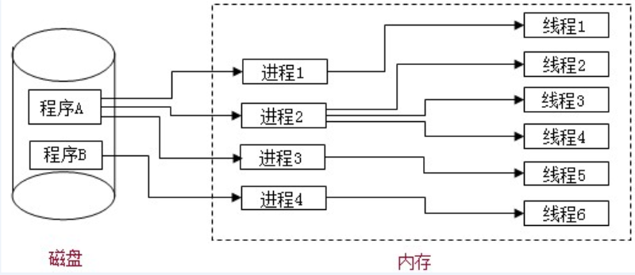

## 1.优雅渐进增强和优雅降级之间的不同
**优雅降级:** Web站点在所有新式浏览器中都能正常工作，如果用户使用的是老式浏览器，则代码会检查以确认它们是否能正常工作。由于IE独特的盒模型布局问题，针对不同版本的IE的hack实践过优雅降级了,为那些无法支持功能的浏览器增加候选方案，使之在旧式浏览器上以某种形式降级体验却不至于完全失效.

**渐进增强:** 从被所有浏览器支持的基本功能开始，逐步地添加那些只有新式浏览器才支持的功能,向页面增加无害于基础浏览器的额外样式和功能的。当浏览器支持时，它们会自动地呈现出来并发挥作用。

## 2.线程与进程的区别
一个程序至少有一个进程，一个进程至少有一个线程。线程的划分尺度小于进程，使得多线程程序的并发性高。

另外，进程在执行过程中拥有独立的内存单元，而多个线程共享内存，从而极大地提高了程序的运行效率。

线程在执行过程中与进程还是有区别的。每个独立的线程有一个程序运行的入口、顺序执行序列和程序的出口。但是线程不能够独立执行，必须依存在应用程序中，由应用程序提供多个线程执行控制。

从逻辑角度来看，多线程的意义在于一个应用程序中，有多个执行部分可以同时执行。但操作系统并没有将多个线程看做多个独立的应用，来实现进程的调度和管理以及资源分配。这就是进程和线程的重要区别。

## 3.你如何对网站的文件和资源进行优化？
期待的解决方案包括：文件合并文件最小化/文件压缩使用CDN托管缓存的使用（多个域名来提供缓存）其他。

## 4.session与cookie

## 5.多进程与多线程
* 进程：程序的一次执行, 它占有一片独有的内存空间
* 线程： CPU的基本调度单位, 是程序执行的一个完整流程
* 进程与线程
  * 一个进程中一般至少有一个运行的线程: 主线程
  * 一个进程中也可以同时运行多个线程, 我们会说程序是多线程运行的
  * 一个进程内的数据可以供其中的多个线程直接共享
  * 多个进程之间的数据是不能直接共享的



* 浏览器运行是单进程还是多进程?
  * 有的是单进程
    * firefox
    * 老版IE
  * 有的是多进程
    * chrome
    * 新版IE
* 如何查看浏览器是否是多进程运行的呢?
  * 任务管理器==>进程
* 浏览器运行是单线程还是多线程?
  * 都是多线程运行的

## 6.浏览器内核
* 什么是浏览器内核?
  * 支持浏览器运行的最核心的程序
* 不同的浏览器可能不太一样
  * Chrome, Safari: webkit
  * firefox: Gecko
  * IE: Trident
  * 360,搜狗等国内浏览器: Trident + webkit
* 内核由很多模块组成
  * html,css文档解析模块 : 负责页面文本的解析
  * dom/css模块 : 负责dom/css在内存中的相关处理
  * 布局和渲染模块 : 负责页面的布局和效果的绘制
  * 定时器模块 : 负责定时器的管理
  * 网络请求模块 : 负责服务器请求(常规/Ajax)
  * 事件响应模块 : 负责事件的管理

## 7.事件循环模型
* 所有代码分类
  * 初始化执行代码(同步代码): 包含绑定dom事件监听, 设置定时器, 发送ajax请求的代码
  * 回调执行代码(异步代码): 处理回调逻辑
* js引擎执行代码的基本流程:
  * 初始化代码===>回调代码
* 模型的2个重要组成部分:
  * 事件管理模块
  * 回调队列
* 模型的运转流程
  * 执行初始化代码, 将事件回调函数交给对应模块管理
  * 当事件发生时, 管理模块会将回调函数及其数据添加到回调列队中
  * 只有当初始化代码执行完后(可能要一定时间), 才会遍历读取回调队列中的回调函数执行


### 宏任务与微任务
来源：掘金
[微任务、宏任务与Event-Loop](https://juejin.im/post/5b73d7a6518825610072b42b#heading-0)

在异步代码中存在宏任务与微任务，微任务总是在宏任务之前执行。
```javascript
+setTimeout(_ => {
-  console.log(4)
+})

+new Promise(resolve => {
+  resolve()
+  console.log(1)
+}).then(_ => {
-  console.log(3)
+})

+console.log(2)
```

` setTimeout`就是作为宏任务来存在的，而`Promise.then`则是具有代表性的微任务，上述代码的执行顺序就是按照序号来输出的。
所有会进入的异步都是指的事件回调中的那部分代码
也就是说`new Promise`在实例化的过程中所执行的代码都是同步进行的，而then中注册的回调才是异步执行的。
在同步代码执行完成后才回去检查是否有异步任务完成，并执行对应的回调，而微任务又会在宏任务之前执行。
所以就得到了上述的输出结论1、2、3、4。

